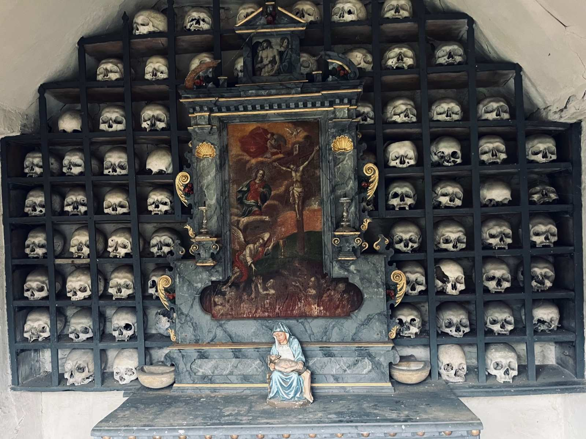

+++
title = "Das letzte Gebet"
date = "2024-02-26"
draft = false
pinned = false
image = "klost.jpg"
description = ""
+++
Früher belebten über dreissig junge Schwestern das Kloster Namen Jesú. Heute sitzen noch fünf am oberen Ende des langen Tisches. In einer schnelllebigen Zeit, wo lebenslange Verpflichtungen kaum noch Bedeutung haben, steht die Gemeinschaft vor ihrem unausweichlichen Ende. Doch wie blicken die Schwestern der Zukunft entgegen und was geschieht mit ihrem langjährigen Zuhause?

Mia Flühmann und Line Gmür

Das Läuten der Glocke hallt durch weitläufige Gänge. Mit dem letzten Schlag kehrt wieder Stille ein. Eine Stille, die für die Bewohnerinnen dieses Gemäuers alltäglich ist. Kurze Zeit darauf hört man von verschiedenen Seiten schlurfende Schritte, die alle das gleiche Ziel haben: das Gebetszimmer. In einem Zimmer mit Wänden, die dem Raum einen holzigen Geruch verleihen, finden sich vier Frauen ein. Bedächtig verbeugt sich eine nach der anderen vor dem Kreuz, bevor sie auf den kissenlosen Holzbänken Platz nehmen. Bis auf Husten und Atmen ist nichts zu hören. Als Letzte betritt Frau Mutter, die Oberin, den Raum. Sie nimmt als Einzige auf einem gepolsterten Stuhl Platz und läutet mit der Klangschale das Mittagsgebet im Kloster Namen Jesú in Solothurn ein.

***Herr Jesus Christus, du Anfang und Ende unserer Wege***\
***Wir wollen mit dir beginnen***\
***Es sind die alten Wege, die damals gegangen***\
***als du mit uns anfingst in der Taufe***

***Weise mir, Herr, deinen Weg. Ich will ihn gehen in Treue zu dir.***

*(Ausschnitt aus dem Mittagsgebet im Kloster Namen Jesú, Stand 5.1.24)*

Hinter der Holztür, auf deren Türrahmen der Schriftzug *C+M+B 23* steht, eröffnet sich das Labyrinth. Ein Geflecht aus Gängen, in dem sich ausschliesslich die Schwestern zurechtfinden. Zuerst betritt man ein Vorzimmer, wo wohl früher eine Schwester die Gäste am Empfang begrüsste. Doch seit jeher ist einige Zeit vergangen und so muss man selbst an der geflochtenen Kordel ziehen, um die Glocke zu betätigen.\
Schon kommt Schwester Therese um die Ecke, als hätte sie auf uns gewartet. Lächelnd begrüsst sie uns. Eine Begrüssung, die von der Gastfreundschaft der Kapuzinerinnen zeugt. Gemächlich werden wir durch einen dunklen, etwas muffig riechenden Korridor geführt, vorbei an einem Trottinett. Dieses Gefährt würde man in einem Kloster nicht vermuten, doch manchmal rollt die Oberin, Schwester Priska, damit durch die weitläufigen Gänge. Geht man morgens durch das Gebäude, so trifft man an den verschiedensten Ecken auf die Schwestern. Jede hat ihre Aufgaben. Schwester Regina ist im Esssaal anzutreffen. Dort staubt die 92-jährige Luzernerin die Bänke mit einem bunten Staubwedel ab oder deckt bereits den Tisch für das Mittagessen. Es soll heute Raclette geben, doch ob man dafür Fondue-Gabeln oder Raclette-Pfännchen benutzt, muss Schwester Regina erst noch nachfragen.

An den Esssaal grenzt eine geräumige Küche. Der Edelstahl glänzt und alles wirkt sehr modern. Die Schwestern kochen jedoch nicht selbst. Sie bestellen oft in einem nahegelegenen Pflegeheim und haben eine Küchenhilfe, die sie regelmässig unterstützt. Auch abseits der Küche erlebt das Klosterleben einen enormen Wandel. Während die Schwesterngemeinschaft früher mit Landwirtschaft und anderen Handwerkskünsten selbstversorgend war, sind die fünf Schwestern, mit einem Altersdurchschnitt von 80 Jahren, heute auf Hilfe von aussen angewiesen. So kümmert sich beispielsweise  eine Gartenbaufirma um die Umgebung, ein Imker um die Bienen und ein Bauer um einen Teil des Landes. Die Zeit des vollkommenen Rückzuges ist vorbei. Doch die Schwestern sind positiv gegenüber der Veränderung gestimmt und schätzen den Kontakt mit anderen Menschen sehr. Sie freuen sich, wenn Bekannte auf einen Kaffee vorbeischauen und mit ihnen plaudern, oder die Gäste in der Kirche ihnen kleine Aufmerksamkeiten zukommen lassen.

***Weise mir, Herr, deinen Weg. Ich will ihn gehen in Treue zu dir.***

Unser Rundgang führt uns weiter zum Lift. Auch dieser wurde gebaut, um das Leben der Schwesternschaft zu erleichtern. Gemeinsam mit Schwester Therese und Schwester Marta fahren wir in den Estrich. Alte Balken und Schnüre, an denen früher Wäsche hing, unebener Boden, modrige kühle Luft und alte Kisten. Es ist eine Zeitreise dahin zurück, als das Klosterleben seine Blütezeit erlebte. Schwester Marta ist mit 19 Jahren in dieses Kloster eingetreten und somit die Dienstälteste. Lächelnd denkt sie zurück an die Zeit, als das Kloster Namen Jesú noch 38 Schwestern zählte. Die gebürtige Solothurnerin lebt schon immer in dieser Stadt und besuchte die Schule dieses Klosters. Gerne fährt die 93-Jährige noch heute mit dem Fahrrad ins Stadtzentrum oder hilft dem Gärtner. Sie liebt ihre Arbeit und denkt nicht daran, sich auf ihrem Alter auszuruhen.\
Mit einem Batch öffnet Schwester Therese die Tür zum hauseigenen Museum. In einem schwach beleuchteten Raum türmen sich Gegenstände aus der Apotheke,  der Schuhmacherei, der Landwirtschaft und der Metzgerei.  “Diese Dinge sollten alle weggeworfen werden. Wenn sie dafür in den Keller gebracht wurden, habe ich sie auf der anderen Seite wieder hochgetragen und in meinem Zimmer oder hier oben versteckt”, erklärt Schwester Marta. Dank ihrer Sammelleidenschaft konnten die Schwestern ihr eigenes Museum errichten. Bisher hatten nur vereinzelt Besuchende Zutritt. Schwester Therese meint aber, ihr Wunsch sei es, das Museum besonders für Schulen zugänglich zu machen, damit dieses traditionelle Leben nicht in Vergessenheit gerate. 

***Weise mir, Herr, deinen Weg. Ich will ihn gehen in Treue zu dir.***

Für Schwester Therese geht es nun an ihre Arbeit. Sie ist für Kirche und Sakristei zuständig. Heute steht etwas Besonderes auf ihrem Arbeitsplan. Sie bereitet das Material für die Segnung des Weihwassers vor. Morgen, am Dreikönigstag, ziehen die Schwestern durchs Haus, beschriften die Türrahmen mit dem Dreikönigssegen und segnen sie mit dem Weihwasser. Die Gebete, die die Schwestern jeden Abend in der Kirche abhalten, sind öffentlich. Doch verirrt sich kaum noch jemand hierher. “Ich habe der Oberin immer gesagt, sie solle noch mehr Heftchen für die Gebete drucken. Es kämen so viele Leute und wir bräuchten sie. Tja, und jetzt haben wir viel zu viele von diesen Heften", erzählt Schwester Therese mit einem bedauerlichen Lächeln.

\
Nach dem Mittagsgebet im Gebetszimmer schreitet die Gemeinschaft bedächtig in den Esssaal. Früher schwiegen die Schwestern bei Tische, doch da sie nur noch zu fünft sind, plaudern sie mittlerweile. Es wird in Erinnerungen geschwelgt, über die Arbeit und Verwandte gesprochen oder über die Zukunft geredet. Letzteres scheint nicht allen Schwestern gleich leicht zu fallen, denn ihnen allen ist klar: Der Klosteralltag wird nicht mehr von langer Dauer sein. Schwester Therese pflegt zu sagen: «Noch fünf Jahre und dann ist fertig.» Wie genau diese Prognose ist, kann man wohl nicht sagen, doch mit dem Ableben der Schwestern wird auch das Klosterleben sterben. Es scheint fast, als würde diese Tatsache die Schwestern mehr belasten als ihre eigene Vergänglichkeit. Früher war das Klosterleben für Frauen ein sozialer Aufstieg. Heute jedoch stehen ihnen viele Türen offen. Das zurückgezogene Leben scheint für jüngere Generationen nicht mehr attraktiv zu sein. Schwester Therese ist vor 30 Jahren als Letzte in das Kloster eingetreten. In dieser Zeit haben etwa 20 Schwestern das Kloster verlassen oder sind verstorben. Die verbliebenen fünf versuchen aber tagtäglich das Beste daraus zu machen und lösungsorientiert in die Zukunft zu blicken.

> «Noch fünf Jahre und dann ist fertig.» *(Schwester Therese)*

\
Im ersten Stock befinden sich die Zellen, die Schlafzimmer. Viele von ihnen stehen jedoch leer. Doch nicht mehr lange. Im Mai 2023 ist ein Projekt im Westflügel des Klosters angelaufen. “Das Zentrum für Arbeit und Stille” soll in Zukunft ein Ort für ruhesuchende Menschen werden und auch Übernachtungsmöglichkeiten anbieten. Es gibt auch bereits erste Pläne, wie das ganze Gebäude nach der Schwesternschaft genutzt werden soll. Den Schwestern ist dabei wichtig, Mitspracherecht bei der Planung zu haben.



Im Kapuzinerinnenkloster Namen Jesú lebt die Schwesterngemeinschaft seit 1609. Jahrhunderte lang lebte der Orden fernab der Gesellschaft. Aufgrund des hohen Alters sind die Schwestern heute auf externe Hilfe angewiesen. So geht es heute den meisten Klöstern. Kaum noch haben junge Menschen Interesse an einem ewigen Gelübde. Man konnte in den letzten Jahren ein  Wachstum an religionslosen Menschen erkennen. Klöster sind ein Spiegel unserer Gesellschaft und daher ist es nur nachvollziehbar, dass es bei einer Gesellschaft im Wandel auch einen solchen im Kloster geben muss. Klöster kämpfen ums Überleben und öffnen sich immer mehr. Sie bieten Urlaub oder  Bildungsmöglichkeiten an, um sich eine Relevanz in unserer schnelllebigen Zeit zu verschaffen.



***Weise mir, Herr, deinen Weg. Ich will ihn gehen in Treue zu dir.***

Der Rundgang endet in der hauseigenen Hostienbäckerei. Die Plättchen aus Wasser und Mehl sind die Haupteinnahmequelle der Schwestern. Die Herstellung ist körperlich sehr anstrengend. Daher haben die Schwestern hierbei Unterstützung von zwei Freiwilligen. Beim Verpacken der Hostien klingelt Schwester Priskas “schnurloses Telefon”, wie die Schwestern ihr Smartphone nennen, mehrmals. Es gibt viele Abnehmer der hochwertigen Hostien. Schwester Priska hilft in der Bäckerei, wenn sie als Oberin nicht anderen Verpflichtungen nachkommen muss. Sie verrichtet das Amt der Oberin schon seit mehreren Jahren und achtet darauf, dass sich jede Schwester ideal entfalten kann. Den nächsten Jahren blickt sie mit gemischten Gefühlen entgegen. Wird sie auf das Ende des Klosters angesprochen, so muss sie erst einmal kurz durchatmen. Mittlerweile könne sie es akzeptieren, denn die Welt habe sich nun einmal verändert und das sei auch in Ordnung so. Jedoch hätte diese Akzeptanz ihre Zeit gedauert und mit der Zukunftsperspektive, die sich durch das Zentrum für Arbeit und Stille bieten, lasse sie optimistisch in die Zukunft blicken. “Solange diese Gemäuer belebt sind, leben auch wir in gewisser Weise weiter.” Das ist, was sie möchten. Auch wenn es zu Ende geht, soll diese Art zu leben nicht vergessen werden.

Bei einer kleinen Kaffeepause wird über die nächsten Tage gesprochen, denn es gibt so einiges zu tun im Kloster Namen Jesú. Es warten noch zahlreiche christliche Feiern, bis im Kloster Namen Jesú das letzte Gebet gesprochen wird. Wir verlassen das Kloster, inspiriert und beeindruckt von diesen offenen und optimistischen Frauen. Trotzdem hinterlässt der Besuch auch eine Bedrücktheit. Fragen über die Zukunft des Klosters beschäftigen uns noch lange. Mit einem letzten Blick auf den Eingang entfernen wir uns von diesem Ort. Morgen am Dreikönigstag wird der Schriftzug über der Tür erneuert. Doch wann die Schwestern das letzte Mal durchs Haus wandern und den Dreikönigssegen vollziehen, das weiss niemand. 

***Weise mir, Herr, deinen Weg. Ich will ihn gehen in Treue zu dir.***

**\*C**hristus **m**ansionem **b**enedicat - Gott segne dieses Haus*

***Amen.***