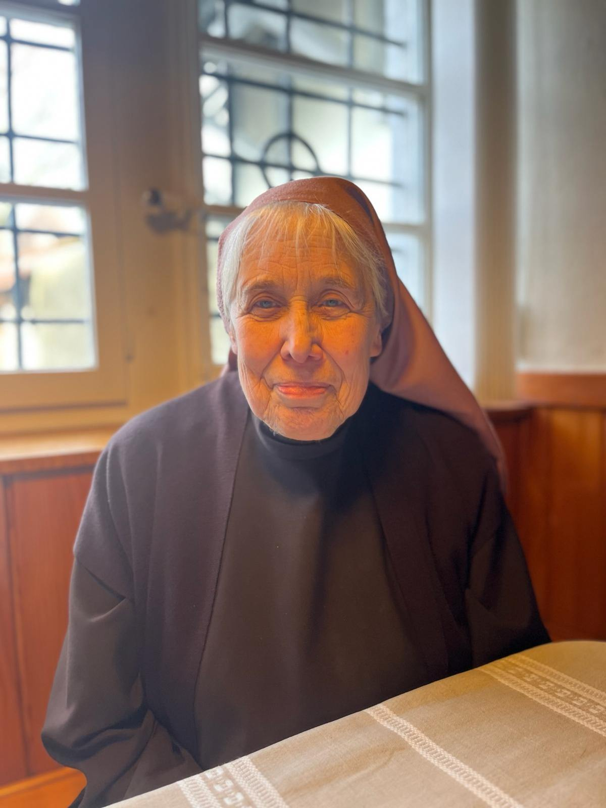

+++
title = "“Noch fünf Jahre und dann ist fertig”"
date = "2024-02-26"
draft = false
pinned = false
image = "therese.jpg"
+++


Die 82-jährige Schwester Therese ist vor 30 Jahren als Letzte ins Kloster Namen Jesú eingetreten. An das zukünftige Bestehen der Schwesterngemeinschaft glaubt sie schon lange nicht mehr.



Line Gmür und Mia Flühmann

Kloster Namen Jesú, Solothurn. Die Uhr tickt. Ansonsten herrscht im Sprechzimmer des Klosters völlige Stille. Über der Uhr hängt ein schlichtes Jesuskreuz, das an der dunklen Holzwand kaum auffällt. Durch die Fenstergitter fällt das schwache Licht der Dezembersonne in den Raum. Auf der Bank vor dem Fenster sitzt Schwester Therese. Etwas nervös sucht sie die perfekte Position für ihre Hände und zupft an ihrem Gewand herum. Einzelne Haarsträhnen fallen aus ihrem selbstgemachten, altrosa-farbenen Kopftuch. Schwester Therese ist 82 Jahre alt und lebt bereits seit dreissig Jahren in dieser Gemeinschaft. Vorher lernte sie in ihrer Heimat Nordrhein-Westfalen Krankenpflegerin, doch schon mit 21 Jahren entschied sie sich für ein Leben im Kloster. Erst lebte sie in einem Kloster in Deutschland, aber als sich die Schwesternschaft nicht mehr gut verstand, fand Schwester Therese im Kloster Namen Jesú ihr neues Zuhause. Wie jedoch die Zukunft ihres Zuhauses aussehen wird, ist noch ungewiss.

#### Hätten Sie als Jugendliche gedacht, dass Sie später in einem Kloster leben würden?

Ja, das war bereits als Jugendliche mein Wunsch. Ich bin in einer katholischen Familie aufgewachsen, aber wir haben nie über den Glauben gesprochen. Wir sechs Kinder gingen alle in die Kirche. Es war klar, dass wir jeden Sonntag hingehen. Wir haben nie nachgefragt. Später hatte ich eine Freundin, die in ihrem Elternhaus viele Glaubensgespräche geführt hat. Mit ihr zusammen habe ich dann auch über den Glauben gesprochen. Da waren wir vierzehn und haben beide Krankenpflegerin gelernt. Sie ist später auch in ein Kloster gegangen, aber ein anderes als ich. Dort lebt sie bis heute noch.

#### Sie waren sehr jung, als Sie ins Kloster eingetreten sind. Hatten Sie am Anfang Zweifel?

Ja, ich war schon sehr jung. Für mich war das schwerste, meinen Beruf als Krankenschwester aufzugeben und nicht so sehr, die Familie zu verlassen. Das Kloster, auch das in Deutschland, ist ein sogenanntes geschlossenes Kloster. Das heisst, wir üben keine Tätigkeiten nach aussen aus. Wir haben keinen Kindergarten, kein Krankenhaus und keine Schule. Wir sorgen für unseren eigenen Unterhalt, haben einen grossen Garten und nähen und waschen alles selbst. 

#### Was hat sich in diesen dreissig Jahren verändert, in denen Sie hier sind?

Wir haben jetzt sehr viele Angestellte, die uns helfen, weil wir nicht mehr alles allein schaffen. Zum Beispiel in der Küche, im Garten, für die Wäsche oder die Krankenpflege. Auch in der Hostienbäckerei haben wir Hilfe. Das wäre früher undenkbar gewesen, dass jemand, der nicht zur Schwesterngemeinschaft gehört, das Kloster betritt. Früher wurde die Klausur sehr streng gehalten, aber jetzt können wir gar nicht anders. Wir sind auf Hilfe angewiesen.

#### In den letzten Jahren ist das Kloster durch das “Zentrum von Arbeit und Stille” und Ihre Mitarbeitenden offener geworden. Wie denken Sie darüber?

Ich finde das sehr positiv, denn mein Wunsch und auch unser Wunsch ist es, dass das Kloster hier nicht einfach stirbt und zugemacht wird, sondern dass es vielleicht in einer anderen Form oder mit anderen Menschen weitergeht. Wir werden ja immer älter. Ich sage immer: Noch fünf Jahre und dann ist fertig.



Seit 1992 lebt die 82- jährige Schwester Therese im Kloster Namen Jesú. Aktuell leben insgesamt noch fünf Schwestern in der Gemeinschaft. Mit einem Altersdurchschnitt von 80 Jahren sind sie auf externe Hilfe angewiesen. Deshalb helfen ihnen zwei pensionierte Männer in der Hostienbäckerei, Gärtner helfen ihnen beim Unterhalt und auch in der Küche bekommen sie durch eine Küchenhilfe Unterstützung. Seit über 400 Jahren wird im Kapuzinerinnenkloster Namen Jesú das monastische Leben der Schwesterngemeinschaft gepflegt. Der Umgang mit der Aussenwelt beschränkte sich früher auf ein Minimum. Heute sieht dies jedoch anders aus. Mit der Organisation "Zentrum für Arbeit und Stille" haben sich die Pforten des Klosters ein gutes Stück geöffnet. Das "Zentrum für Arbeit und Stille" nutzt einen Teil der Klosterräume und bietet schöne, stille Arbeitsräume und Ateliers an. Auch der Garten soll in Zukunft für die Öffentlichkeit zugänglich gemacht werden. Auf der 2,8 Hektar grossen Fläche sollen Führungen, Workshops und kulturelle Veranstaltungen stattfinden. Das Leben des vollkommenen Rückzuges ist vorbei.



#### Wie viel bekommen Sie vom Geschehen ausserhalb des Klosters mit?

Wir lesen die Solothurner Tageszeitung. Eine Schwester kam aus Luzern, sie ist schon lange verstorben, aber die Zeitung von Luzern kriegen wir immer noch. Sonntagabend schauen wir gemeinsam im Fernseher die Nachrichten. An anderen Tagen dürften wir eigentlich auch die Nachrichten schauen, doch meistens haben wir dann Gebetszeit. Einmal in der Woche haben wir einen freien Tag, da können wir zum Beispiel auch einen Film schauen.

> "Wir sind auf Hilfe angewiesen" (Schwester Therese)

#### Was denken Sie über die heutige Jugend?

Ich kenne zu wenig junge Leute, aber ihr macht einen sehr guten Eindruck. Sehr solide, einfach und freundlich. Wir haben im Kloster einen jungen Gärtner. Er heisst David, ist einundzwanzig Jahre alt und hilft Schwester Marta im Garten. Er verehrt uns und ist immer sehr zuvorkommend. Er schätzt uns sehr.

#### Denken Sie, dass das Klosterleben in unserer modernen, schnelllebigen Welt noch relevant ist?

Ich glaube nicht. Da muss einfach etwas anderes kommen, eine andere Gemeinschaft mit anderen Aufgaben. Ich glaube, so kann es nicht weitergehen, weil junge Menschen sich nicht mehr vorstellen können, dieses versteckte Leben zu führen.

#### Was müsste sich aus Ihrer Sicht ändern, damit sich junge Menschen für ein Klosterleben interessieren?

Es bräuchte mehr Offenheit und wahrscheinlich auch, dass man sich nicht mehr auf Lebenszeit verpflichten muss. Eine Verpflichtung bis ans Lebensende, das glaube ich, geht heute nicht mehr. Die Ehen heute halten ja meistens auch nicht mehr bis zum Lebensende.

#### Gibt es konkrete Pläne, was in Zukunft mit dem Kloster passieren wird?

Im Moment noch nicht. Aber es sind Gespräche im Gange. Die Leute vom “Zentrum für Arbeit und Stille”, die machen schon ein paar Pläne. Sie rechnen aber damit, dass wir noch eine Weile hier bleiben.

#### Können Sie bei diesen Plänen mitreden?

Ich glaube schon. Das ist uns auch wichtig. Wir sagen ihnen auch immer, sie sollen vorwärts machen. Wir möchten noch mitreden, was nach uns hier geschieht. Jetzt können wir noch.

#### Was wünschen Sie sich für Ihre Zukunft und für die des Klosters?

Ich wünsche mir, dass eine andere Gemeinschaft das Kloster übernehmen wird. Das wäre ideal. Wir wünschen uns, dass wir hier im Kloster noch unseren Lebensabend verbringen können. Für meine persönliche Zukunft denke ich eigentlich nur ans Pflegeheim. Das würde mich nicht so stören.

> "Wir möchten noch mitreden, was nach uns hier geschieht. Jetzt können wir noch." (Schwester Therese)